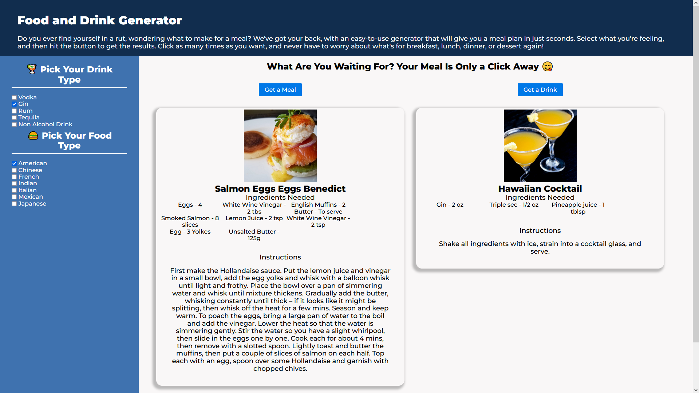

# Meal Creator

## Image of Application

(Image Screenshot)

## Description

This is a meal creator that will give a random recipe based on criteria by the input of the user.

## Utility

- Takes user input from checkbox
- Shows random recipe based off user input
- Displays ingredients, measurements
- Displays image of meal/drink
- Detailed recipe with instructions
- Can be repeated until desired results

## Resources Used

- HTML
- CSS
- JavaScript
- JQuery
- TheMealDB API
- TheCocktailDB API
- Foundation

### URL to Deployed Application: https://drew990.github.io/cooking/

Made by Nitish Doss, Andrew Banagas, and Austin Schumacher
