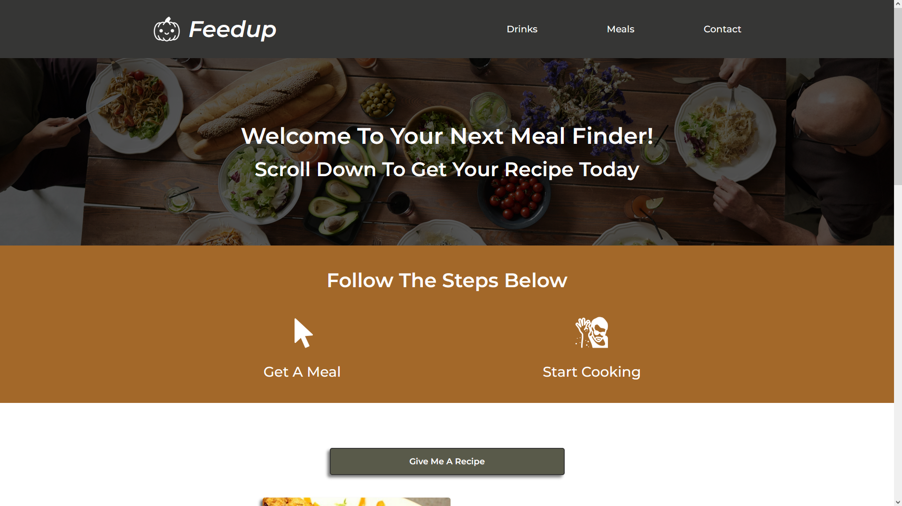

# Meal Creator

## Image of Application

## Description

This is a meal creator that will give a random recipe when loading up the page or pressing the recipe button. The drinks include various alcohol bases as well as a non-alcoholic option. The recipes, consisting of the title, an image, ingredients and measurements, and a detailed description of how to make the meal/drink, show up in the respective card.

<!-- based on criteria by the input of the user. There are two lists of checkboxes that serve as selectable options for types of drinks and areas of origin for meals. The meals options are various cuisines.If nothing is selected and a button is pressed, the user will be prompted to select an option first. -->

## Utility

- Displays ingredients, measurements
- Displays image of meal/drink
- Detailed recipe with instructions

- Can be repeated until desired results

<!--
- Takes user input from checkbox selection
- Shows random recipe based off user input
- Requires selection before usage -->

## Resources Used

- HTML
- CSS
- React.JS
- Netlify
- JavaScript
- TheMealDB API
- TheCocktailDB API
  <!-- - JQuery -->
  <!-- - Pure Framework -->

<!-- We used HTML and CSS assisted by the Pure Framework in order to create our website. The recipe selector was made possible through functions in JavaScript calling theMealDB and theCocktailDB API's. -->

### URL to Deployed Application: https://feedupcooking.netlify.app/

Made by Nitish Doss, Andrew Banagas, and Austin Schumacher
